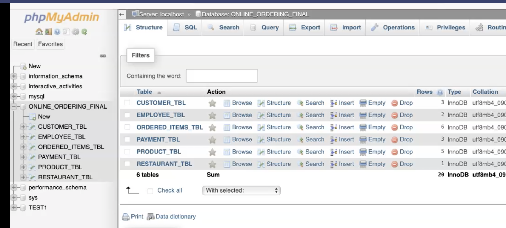

<!-- Improved compatibility of back to top link: See: https://github.com/othneildrew/Best-README-Template/pull/73 -->
<a name="readme-top"></a>

<!-- PROJECT SHIELDS -->
<!--
*** I'm using markdown "reference style" links for readability.
*** Reference links are enclosed in brackets [ ] instead of parentheses ( ).
*** See the bottom of this document for the declaration of the reference variables
*** for contributors-url, forks-url, etc. This is an optional, concise syntax you may use.
*** https://www.markdownguide.org/basic-syntax/#reference-style-links
-->

[![Contributors][contributors-shield]][contributors-url]
[![Forks][forks-shield]][forks-url]
[![Stargazers][stars-shield]][stars-url]
[![Issues][issues-shield]][issues-url]
[![MIT License][license-shield]][license-url]
[![LinkedIn][linkedin-shield]][linkedin-url]


<!-- PROJECT LOGO -->
<div align="center">
    <h3 align="center">Online Food Ordering Database</h3>
  <a href="https://github.com/karlasanc/Online-Ordering-Database">
    
  </a>
  <br>
  <br>
  <p align="center">
    A prebuilt datatbase to jumpstart your online food ordering applications.
    <br>
    <a href="https://github.com/karlasanc/Online-Ordering-Database"><strong>Explore the docs »</strong></a>
    <br>
    <a href="https://github.com/karlasanc/Online-Ordering-Database">View Demo</a>
    ·
    <a href="https://github.com/karlasanc/Online-Ordering-Database/issues">Report Bug</a>
    ·
    <a href="https://github.com/karlasanc/Online-Ordering-Database/issues">Request Feature</a>
  </p>
</div>


<!-- TABLE OF CONTENTS -->
<details>
  <summary>Table of Contents</summary>
  <ol>
    <li>
      <a href="#about-the-project">About The Project</a>
      <ul>
        <li><a href="#built-with">Built With</a></li>
      </ul>
    </li>
    <li>
      <a href="#getting-started">Getting Started</a>
      <ul>
        <li><a href="#prerequisites">Prerequisites</a></li>
        <li><a href="#installation">Installation</a></li>
      </ul>
    </li>
    <li><a href="#usage">Usage</a></li>
    <li><a href="#roadmap">Roadmap</a></li>
    <li><a href="#contributing">Contributing</a></li>
    <li><a href="#license">License</a></li>
    <li><a href="#contact">Contact</a></li>
    <li><a href="#acknowledgments">Acknowledgments</a></li>
  </ol>
</details>


<!-- ABOUT THE PROJECT -->
## About The Project

[![Product Name Screen Shot][product-screenshot]](https://example.com)

Here's a blank template to get started: To avoid retyping too much info. Do a search and replace with your text editor for the following: `karlasanc`, `Online-Ordering-Database`, `twitter_handle`, `karlasanc`, `email_client`, `email`, `Online Food Ordering Database`, `A prebuilt datatbase to jumpstart your online food ordering applications.`

This is a pre-built relational database structure designed and implemented for an online food ordering application to facilitate seamless food ordering and delivery processes for a restaurant. The database is meant to stores, manages, and displays customer, restaurant, employee, product, order and payment information.

Project create for CPT310: Database Systems & Management course at the University of Arizona Global Campus.

<p align="right">(<a href="#readme-top">back to top</a>)</p>


### Built With

* MySQL Database Server
* SQL Web Server Package
* SQL Database Programming Language
* phpMyAdmin Database Management System

<p align="right">(<a href="#readme-top">back to top</a>)</p>


<!-- GETTING STARTED -->
## Getting Started

This is an example of how you may give instructions on setting up your project locally.
To get a local copy up and running follow these simple example steps.

### Prerequisites

This is an example of how to list things you need to use the software and how to install them.
* npm
  ```sh
  npm install npm@latest -g
  ```

### Installation

1. Get a free API Key at [https://example.com](https://example.com)
2. Clone the repo
   ```sh
   git clone https://github.com/karlasanc/Online-Ordering-Database.git
   ```
3. Install NPM packages
   ```sh
   npm install
   ```
4. Enter your API in `config.js`
   ```js
   const API_KEY = 'ENTER YOUR API';
   ```

<p align="right">(<a href="#readme-top">back to top</a>)</p>


<!-- USAGE EXAMPLES -->
## Usage

1. Download the food-ordering.sql & testDatabase.sql from the repository files before moving to the next step.<br>
2. Create a new database schema for downloaded files.<br><br>
   <br>
  a. Select New on the left-side menu to create new datatabase.<br>
  b. Name the Database your own chosen name.<br>
  c. Ensure utf8bb4_general_ci is selected from the collation drop down menu.<br>
  d. Click Create.<br>
4. Import Database files.<br><br>
   <br>
  a. Ensure the new database is selected.<br>
  b. Click the Import tab at the top menu.<br>
  c. Ensure you are importing to the selected database.<br>
  d. Select Choose File and select the database file you imported earlier on your PC and click Go.<br>
  
_For more examples, please refer to the [Documentation](https://example.com)_

<p align="right">(<a href="#readme-top">back to top</a>)</p>


<!-- CONTRIBUTING -->
## Contributing

Contributions are what make the open source community such an amazing place to learn, inspire, and create. Any contributions you make are **greatly appreciated**.

If you have a suggestion that would make this better, please fork the repo and create a pull request. You can also simply open an issue with the tag "enhancement".
Don't forget to give the project a star! Thanks again!

1. Fork the Project
2. Create your Feature Branch (`git checkout -b feature/AmazingFeature`)
3. Commit your Changes (`git commit -m 'Add some AmazingFeature'`)
4. Push to the Branch (`git push origin feature/AmazingFeature`)
5. Open a Pull Request

<p align="right">(<a href="#readme-top">back to top</a>)</p>


<!-- LICENSE -->
## License

Distributed under the MIT License. See `LICENSE.txt` for more information.

<p align="right">(<a href="#readme-top">back to top</a>)</p>


<!-- CONTACT -->
## Contact

Karla Sanchez - [@twitter_handle](https://twitter.com/twitter_handle) - email@email_client.com

Project Link: [https://github.com/karlasanc/Online-Ordering-Database](https://github.com/karlasanc/Online-Ordering-Database)

<p align="right">(<a href="#readme-top">back to top</a>)</p>


<!-- ACKNOWLEDGMENTS -->
## Acknowledgments

* [Eessaar, E. (2016). The database normalization theory and the theory of normalized systems: Finding a common ground. Baltic Journal of Modern Computing](https://www.researchgate.net/publication/297731569_The_Database_Normalization_Theory_and_the_Theory_of_Normalized_Systems_Finding_a_Common_Ground)
* Coronel, C., & Morris, S. (2019). Database systems: Design, implementation, and management (13th ed.).
* [Fatbit Technologies. (n.d.) Online Food Delivery Business Models.](https://www.fatbit.com/fab/online-food-delivery-business-models/)

<p align="right">(<a href="#readme-top">back to top</a>)</p>


<!-- MARKDOWN LINKS & IMAGES -->
<!-- https://www.markdownguide.org/basic-syntax/#reference-style-links -->
[contributors-shield]: https://img.shields.io/github/contributors/karlasanc/Online-Ordering-Database.svg?style=for-the-badge
[contributors-url]: https://github.com/karlasanc/Online-Ordering-Database/graphs/contributors
[forks-shield]: https://img.shields.io/github/forks/karlasanc/Online-Ordering-Database.svg?style=for-the-badge
[forks-url]: https://github.com/karlasanc/Online-Ordering-Database/network/members
[stars-shield]: https://img.shields.io/github/stars/karlasanc/Online-Ordering-Database.svg?style=for-the-badge
[stars-url]: https://github.com/karlasanc/Online-Ordering-Database/stargazers
[issues-shield]: https://img.shields.io/github/issues/karlasanc/Online-Ordering-Database.svg?style=for-the-badge
[issues-url]: https://github.com/karlasanc/Online-Ordering-Database/issues
[license-shield]: https://img.shields.io/github/license/karlasanc/Online-Ordering-Database.svg?style=for-the-badge
[license-url]: https://github.com/karlasanc/Online-Ordering-Database/blob/master/LICENSE.txt
[linkedin-shield]: https://img.shields.io/badge/-LinkedIn-black.svg?style=for-the-badge&logo=linkedin&colorB=555
[linkedin-url]: https://linkedin.com/in/karlasanc
[product-screenshot]: images/logo.png
